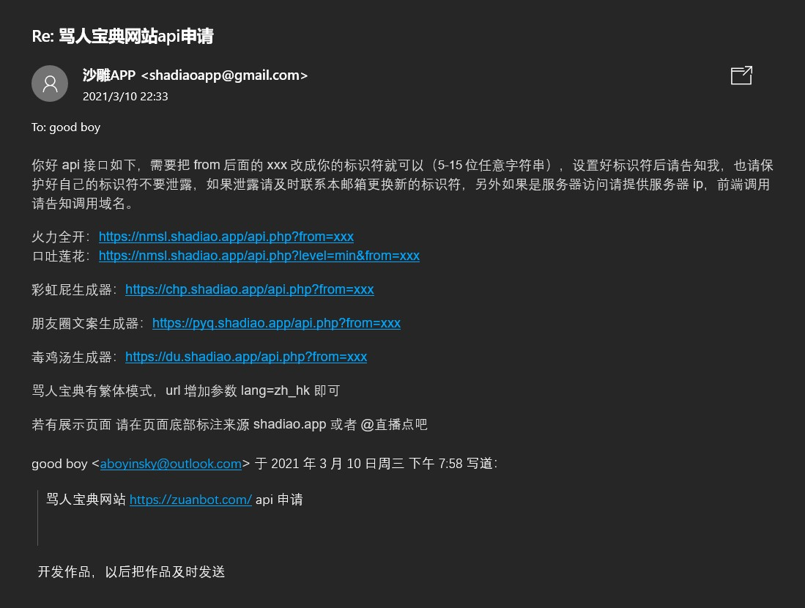

## 聊天机器人-BotCamel_V1.0
> 基于/重构[go-cqhttp](https://github.com/Mrs4s/go-cqhttp/)实现-觉得有意思的话就star一下吧~

> [BotCamel_V0](https://github.com/StrayCamel247/BotCamel/tree/dev-mirai)版本为基于mirai实现
## [需求文档](./PRD.MD)
> 欢迎任何人-领任务-fork-提pr请求

任务领取可发送到aboyinsky@ouotlook.com邮箱
### 需求概览
## 项目启动
> 输入自己的账号密码可以构建自己的机器人哦
- windows
  - 安装go（很简单百度就会了）
  - [安装gcc](https://zhuanlan.zhihu.com/p/47935258),数据库需要用（若没有数据库，无法使用命运2 的中文查询词条/武器功能）
  - 配置机器人qq账号密码
  - 启动命令:`go run main.go` 若没有配置文件会生成一个配置文件
  - `config.hjson`生成或者已存在-文件内填写qq账号密码；  `screenshotmaster`为[截屏大师网站](https://www.screenshotmaster.com/reg)的token 注册填入即可
  - `apps\base_default.yaml`配置对话
  - `apps\baseapis`调用的接口
  - 若启动报错，尝试删除`go.mod`, `go.sum`文件，并运行`go mod init github.com/StrayCamel247/BotCamel`，再运行`go run main.go`启动
  - 若还是有问题请issue
  - 编译`go build`后点击exe文件即可后台运行
## REFERENCE
> 对我有帮助和启发的项目都放在这里了
https://github.com/azmiao/destiny2_hoshino_plugin/
https://github.com/tianque1/Destiny2_bot
https://www.screenshotmaster.com/docs

**api授权**

## DEMO

- version 1.2

  

<!-- ```
go mod
The commands are:
  download    download modules to local cache (下载依赖的module到本地cache))
  edit        edit go.mod from tools or scripts (编辑go.mod文件)
  graph       print module requirement graph (打印模块依赖图))
  init        initialize new module in current directory (再当前文件夹下初始化一个新的module, 创建go.mod文件))
  tidy        add missing and remove unused modules (增加丢失的module，去掉未用的module)
  vendor      make vendored copy of dependencies (将依赖复制到vendor下)
  verify      verify dependencies have expected content (校验依赖)
  why         explain why packages or modules are needed (解释为什么需要依赖)
``` -->